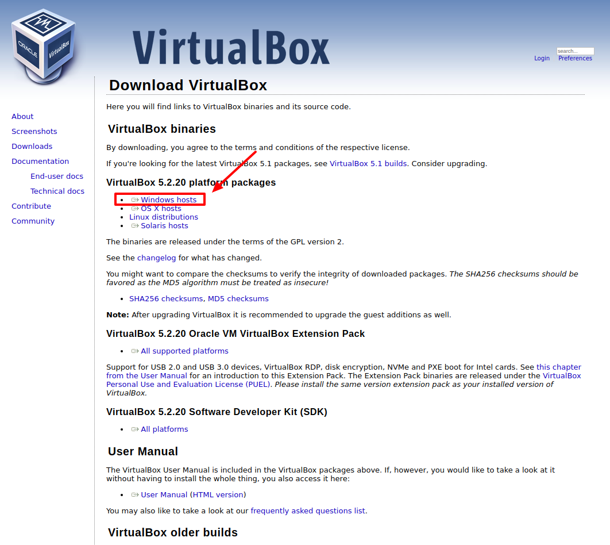

## Documentación instalar Virtualbox y Vagrant en Windows
A lo largo de este taller vamos a aprender conceptos como qué es una máquina virtual, qué ventajas ofrecen o como instalar una máquina virtual en un entorno Windows.

1. [Definiciones: Virtualbox, Vagrant, Máquina Virtual](#1-definiciones-virtualbox-vagrant-m%C3%A1quina-virtual)
2. [Instalación VirtualBox](#2-instalaci%C3%B3n-virtualbox)
3. [Instalación Vagrant](#3-instalaci%C3%B3n-de-vagrant)
4. [Vagrantfile y creación de VMs](#4-vagrantfile-y-creaci%C3%B3n-de-vms)

### 1. Definiciones: Virtualbox, Vagrant, Máquina Virtual
Una máquina virtual es un software, un programa informático, que nos permite cargar en su interior otro sistema operativo. Las máquinas virtuales nos permiten emular un entorno de desarrollo acorde a nuestras necesidades. Son ordenadores completos con su propio disco duro, memoria, tarjeta gráfica o cualquier otro componente de hardware, aunque todos ellos son virtuales.   
Este aspecto no quiere decir que no existan. Obviamente estos recursos salen del equipo donde está instalada la máquina virtuales, también conocida como _hipervisor_, _host_ o _anfitrión_.   
Para el sistema operativo que se ejecuta en el interior de la máquina virtual toda esta emulación es transparente, todo funciona igual que si se estuviera ejecutando en un equipo normal.
La máquina virtual no puede acceder a la máquina anfitrión aunque existen herramientas para poder compartir carpetas o dispositivos como memorias externas.

### 2. Instalación VirtualBox
Lo primero que tenemos que hacer para empezar a utilizar VirtualBox (VB) es descargar e instalar el software.
1. Vamos a la página oficial: https://www.virtualbox.org/wiki/Downloads y descargamos la versión de VirtualBox nuestro sistema operativo. En este tutorial vamos a cubrir la instalación de Windows.
2. Descargamos la versión que nos interesa:
. Instalamos el paquete básico haciendo doble click sobre él y siguiendo las sencillas instrucciones que presenta.

3. Descargargamos también la última versión del paquete de extensiones, que es el mismo para todos los sistemas operativos donde se instale VB.
. Instalar el paquete de extensiones haciendo doble click sobre él y siguiendo las instrucciones básicas que presenta.
4. (OPCIONAL) Si queremos contar con las _Guest Additions_, éstas se instalarán sobre cada una de las MMVV. Su instalación es diferente de la instalación propia de VB. Estas sirven para mejorar la comunicación entre el anfitrión y una MV concreta.
5. En la siguiente imagen se puede ver la pantalla principal de VirtualBox.

A la izquierda, se puede ver un panel que mostrará una lista con todas las Máquinas Virtuales (MMVV). En este momento no se ha creado ninguna por lo que la lista está vacía.  La fila de botones de la parte superior permiten crear nuevas MMVV y trabajar con MMVV existentes. El panel de la derecha muestra por secciones las propiedades de la MV que estuviera seleccionada y su árbol de instantáneas.

### 3. Instalación de Vagrant
##### ¿Qué es Vagrant?
- Vagrant es una herramienta para la creación y configuración de entornos de desarrollo virtualizados. Vagrant se encarga de emular un servidor real, con una IP (Local) y con un nombre de dominio de nuestra elección, sobre el cual vamos a poder desarrollar como si se tratara de una máquina en un servidor online real.  
- Vagrant Descarga una sola vez una imagen del Sistema Operativo que puedes replicar para cada uno de los proyectos que desees que tengan configuraciones diferentes.  
- Ofrece la facilidad de configurar toda una máquina Virtual a través de un archivo de configuración conocido como **Vagrantfile**.  
- Vagrant también incluye una herramienta de consola: permite automatizar procesos en lugar de crear máquinas virtuales y entornos de desarrollo manualmente. Este lenguaje de scripting permite compartir configuraciones de cada proyecto, sin almacenar las máquinas virtuales completas, ahorrando espacio en disco.   

##### ¿Para que NO sirve Vagrant?
- No está pensado para gestionar la infraestructura de servidores.
- No está pensado para ejecutarse en un servidor, sino en el propio equipo del desarrollador
- No está pensado para producción.

Para poder empezar a trabajar con Vagrant vamos a seguir los siguientes pasos:
1. Descarga desde la página oficial: https://www.vagrantup.com/downloads.html. Elige la versión que se ajuste a tus necesidades.
2. Instala el software.

### 4. Vagrantfile y creación de VMs
A continuación, vamos a comenzar a utilizar Vagrant. Para ello, abrimos una consola. Podemos utilizar la consola por defecto de Windows (cmd) o instalar alguna otra como [Cygwin](http://www.cygwin.com/),  [cmder](http://cmder.net/) o [Git](https://git-scm.com/downloads).
1. Para abrir una consola de Windows tenemos varias opciones:
     - Teclear `cmd` en el menú contextual de Windows
     - Pulsar la tecla de `Windows` + `R` y despúes escribir `cmd`.
     - Buscar en los menús de Windows por **Símbolo de Sistema**.
     - `Shift` + `Click Dcho` dentro de la carpeta -> `Abrir terminal`/`Àbrir ventana de comandos aquí`.
2. Navegamos hasta el directorio donde vayamos a crear la máquina virtual.
     - Para navegar por los directorios utilizamos el comando `cd`  + `nombre-de-carpeta` o `ruta`.
     - Para subir un nivel `../`.

   Una vez en el directorio donde queremos crear la máquina virtual tecleamos en la consola el siguiente comando (sin el símbolo del dólar):

     ```shell
     $ vagrant init
     ```
   Este comando creará un fichero `Vagrantfile` donde configuraremos la máquina virtual. Podemos abrir este archivo de texto (sin extensión) con cualquier editor de texto y observar detenidamente los comentarios antes de comenzar la configuración.  

   Un ejemplo sencillo de Vagrantfile podría ser el siguiente:

     ```shell
     # -*- mode: ruby -*-
     # vi: set ft=ruby :
     Vagrant.configure("2") do |config|
         config.vm.box = "ubuntu/xenial64"
         config.vm.box_url = config.vm.box_url =  "https://app.vagrantup.com/ubuntu/boxes/xenial64"
         config.vm.synced_folder "project/", "/project/"
         config.vm.network "forwarded_port", guest: 6543, host: 9000
         config.vm.network "forwarded_port", guest: 5432, host: 9001
         config.vm.provision "shell", path:"server/bootstrap.sh"
     end
     ```   
   1. Estamos indicando que use una imagen de `Ubuntu 16.04` llamada `xenial64` y la URL de donde puede descargarla.
   2. Se indica qué carpetas queremos que se sincronicen en local con la máquina virtual, en este caso tendrá todo el código de un proyecto en una carpeta llamada `project` en mi entorno local. De esta manera podremos utilizar por ejemplo un editor de código como _Sublime Text_ o cualquier otro con el que nos sintamos cómodos. Todo lo que modifiquemos se modificará automáticamente en la carpeta `/project` de la maquina virtual linux que hemos creado.
   3. Tambien indicamos que los puertos `6543` y `5432` de la maquina virtual (`guest`) se relacionen con los puertos `9000` y `9001` de mi local (`host` o _Anfitrión_). De esa forma podríamos usar el navegador local para correr los proyectos que se ejecutan en la máquina virtual usando el mismo puerto.   
   4. Por último, con el comando `config.vm.provision` indicamos la ruta a un script en `bash` con los comandos que instalarán en el OS todas las dependencias y software que necesitamos para crear nuestro entorno.   

3. Para poner en marcha la máquina virtual o _levantarla_, utilizamos el comando:
     ```shell
     $ vagrant up
     ```
   Este proceso puede llevar un rato mientras se descarga la imagen `.box` del sistema operativo si es la primera vez, y ejecuta todas las instalaciones que hemos indicado en los scripts.
     - Estas _base box_ se encuentran en  `%userprofile%/.vagrant.d/boxes`.
     - Puedes listarlas con el comando `vagrant box list`.
     - Puedes eliminarlas con `vagrant box remove box/name`.

4. Es posible que encontremos algún problema relacionado a la hora de conectarnos a la máquina virtual mediante `SSH`. Windows no viene con un cliente de línea de comandos `SSH`. Esto impica que funciones `SSH` integradas de Vagrant puedan no funcionar para los usuarios de Windows.

   Si nos encontramos con este problema (conectarnos a la máquina por `SSH`) podemos instalar `PuTTY`, `PuTTY`, un cliente `SSH` con licencia libre. Dentro introduciremos la IP y el puerto, otorgamos un nombre a la conexión y salvamos la información. El nombre de usuario y contraseña es `vagrant` (configurable).

   

   Escriba esto para obtener su información SSH cuando la necesite:
    ```shell
    $ vagrant ssh-config
    ```
   Otra opción es configurar Vagrantfile para que no utilice una clave `SSH` aleatoria al hacer `vagran up` añadiendo la siguiente línea al archivo. RECOMENDADO.
   ```shell
   config.ssh.insert_key = false
   ```
   De lo contrario, sólo podremos conectarnos a la máquina virtual mediante Vagrant la primera vez.

   Para conectarnos a la máquina virtual utilizamos el comando:
    ```shell
    $ vagrant ssh
    ```
   Para salir ejecutar `exit`.

   A partir de este momento estamos dentro de la máquina virtual. Recordemos que hemos instalado Ubuntu, una distribución de Linux y por lo tanto vamos a tener a nuestra disponibilidad todas las características propias de este entorno.

   Si por ejemplo queremos conocer qué `IP` tiene nuestra máquina podemos ejecutar `ifconfig` o listar todos los elementos de la carpeta raíz.

   

5. Otros comandos útiles:

   Parar la máquina virtual:
    ```shell
    $ vagrant halt
    ```
   Suspender la máquina:
     ```shell
     $ vagrant suspend
     ```
   Volver a iniciar la máquina
     ```shell
     $ vagrant up
     ```
   Reiniciar la máquina si ya la tienes corriendo
     ```shell
     $ vagrant reload
     ```
     Este comando es util cuando modificamos `Vagrantfile` y queremos ver los cambios.
     
   Eliminar completamente la máquina  
     ```shell
     $ vagrant destroy
     ```
   Volver a ejecutar tu script de arranque (si lo has actualizado) sin tener que crear la máquina virtual desde cero.
     ```shell
     $ vagrant provision
     ```

### Otras utilidades
Exportar una máquina virtual:
```shell
$ vagrant package --output mynew.box
```
Tras este comando habremos creado un nuevo archivo llamado `mynew.box`. A continuación podemos añadir esta nueva Vagrant Box a Vagrant con el comando:
```shell
$ vagrant box add mynewbox mynew.box
```
Por último, para iniciar esta Vagrant Box ejecutamos:
```shell
$ vagrant init mynewbox
```

Conectar dos máquinas virtuales. Cómo conectar desde una máquina virtual (windows guest) a una base de datos, web, etc. que esté en otra máquina virtual. Editar `C:\windows\system32\drivers\etc\hosts` para añadir la línea:
 ```shell
 10.0.2.2   outer
 ```


### Referencias
- _Getting Started with Vagrant on Windows._ [Enlace](https://www.sitepoint.com/getting-started-vagrant-windows/).
- _Máquinas virtuales: qué son, cómo funcionan y cómo utilizarlas_. [Enlace](https://www.xataka.com/especiales/maquinas-virtuales-que-son-como-funcionan-y-como-utilizarlas).
- _Tutorial sobre VirtualBox._ [Enlace](http://fpg.x10host.com/VirtualBox/en_windows.html).
- _How to Create a Vagrant Base Box from an Existing One._ [Enlace](https://scotch.io/tutorials/how-to-create-a-vagrant-base-box-from-an-existing-one).
- _Desarrolla con Vagrant & VirtualBox en Windows._ [Enlace](https://www.webmip.es/desarrolla-con-vagrant-virtualbox-en-windows-tutorial/).
- _Guía rápida de Vagrant – Todo lo que necesitas saber._ [Enlace](https://albertoromeu.com/guia-rapida-vagrant/).
- _Cómo configurar un entorno de desarrollo virtual con Vagrant_. [Enlace](https://carlosazaustre.es/como-configurar-un-entorno-de-desarrollo-virtual-con-vagrant/).