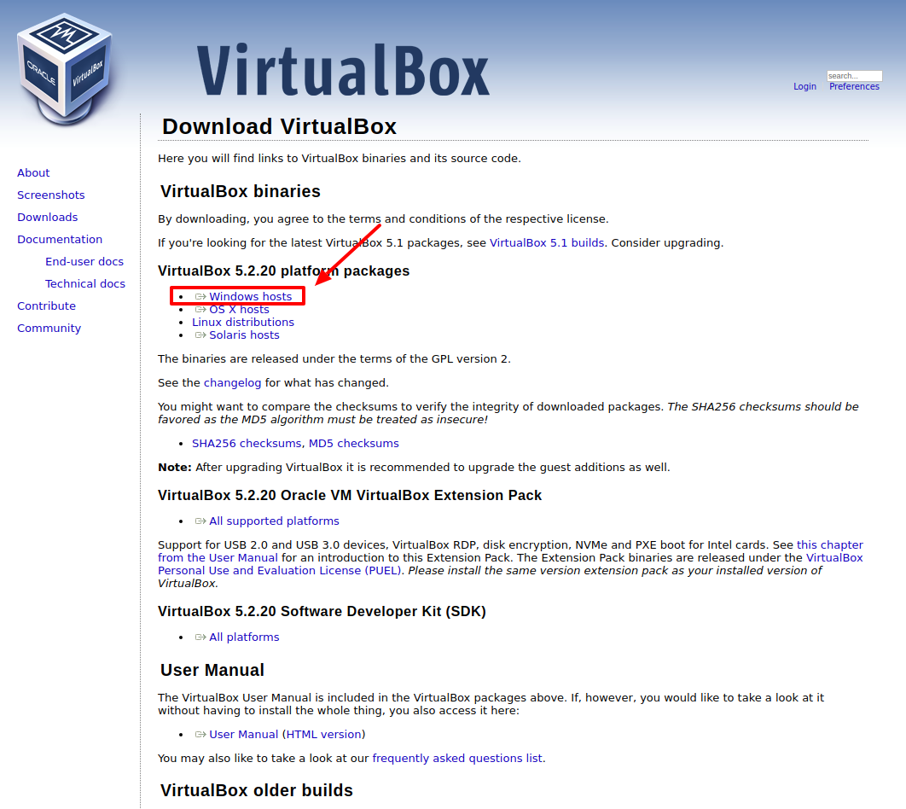

## Documentación instalar Virtualbox y Vagrant en Windows
A lo largo de este taller vamos a aprender conceptos como qué es una máquina virtual, qué prestaciones nos ofrecen y como instalarla en un entorno Windows.

1. Definiciones: Virtualbox, Vagrant, Máquina Virtual
2. Instalación VirtualBox
3. Instalación Vagrant
4. Vagrantfile y creación de VMs

### 1. Definiciones: Virtualbox, Vagrant, Máquina Virtual
Una máquina virtual es un software, un programa informático, que nos permite cargar en su interior otro sistema operativo. Las máquinas virtuales nos permiten emular un entorno de desarrollo acorde a nuestras necesidades. Son ordenadores completos con su propio disco duro, memoria, tarjeta gráfica o cualquier otro componente de hardware, aunque todos ellos son virtuales.   
Que estos componentes sean virtuales no quiere decir que no existan, obviamente estos recursos salen del equipo donde está instalada la máquina virtuales, también conocida como _hipervisor_, _host_ o _anfitrión_.   
Para el sistema operativo que se ejecuta en el interior de la máquina virtual toda esta emulación es transparente, todo funciona igual que si se estuviera ejecutando en un equipo normal.
La máquina virtual no puede acceder a la máquina anfitrión aunque existen herramientas para poder compartir carpetas o dispositivos como memorias externas (Discos duros/USB).

### 2. Instalación VirtualBox
Lo primero que tenemos que hacer para empezar a utilizar VirtualBox es descargar e instalar el software.
1. Vamos a la página oficial: https://www.virtualbox.org/wiki/Downloads y descargamos la versión de VirtualBox nuestro sistema operativo. En este tutorial vamos a cubrir la instalación de Windows.
2. Descargamos la versión que nos interesa:
.
3. 

### Referencias
-  Máquinas virtuales: qué son, cómo funcionan y cómo utilizarlas (_En Xataka_). [Enlace](https://www.xataka.com/especiales/maquinas-virtuales-que-son-como-funcionan-y-como-utilizarlas).