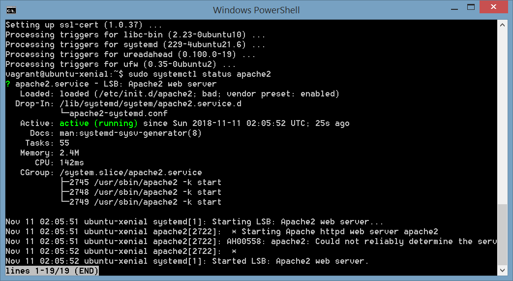
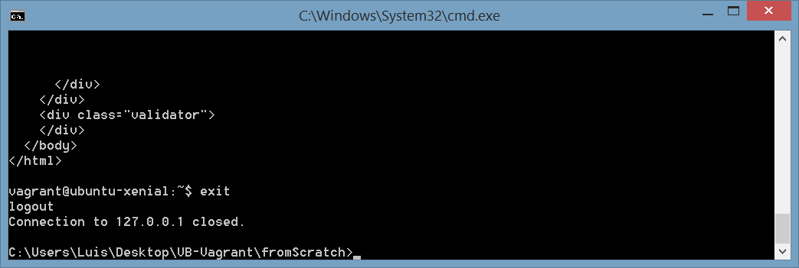
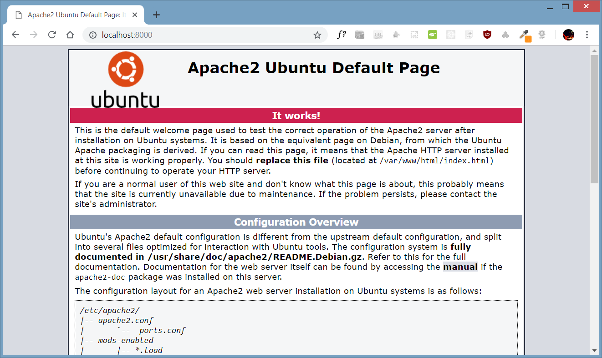
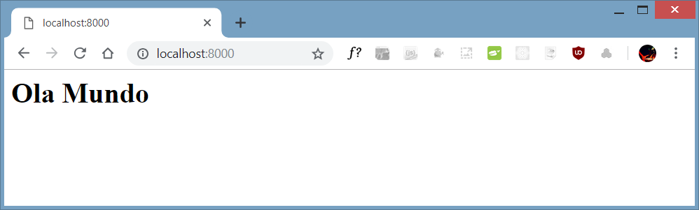
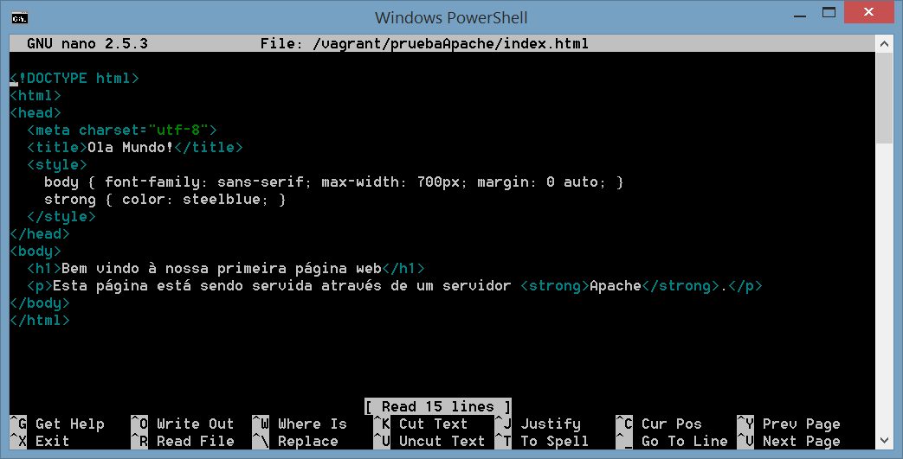
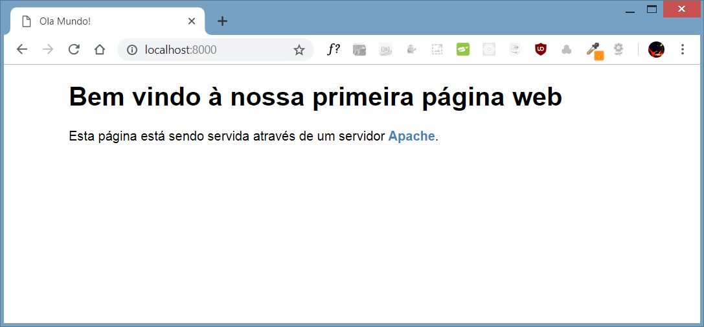
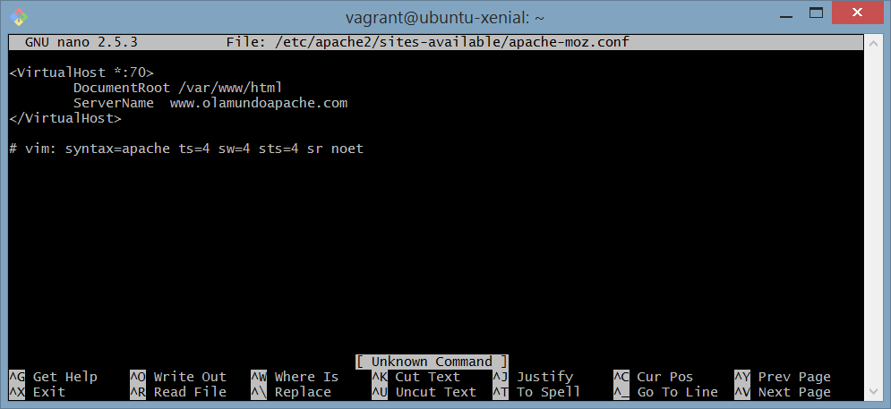
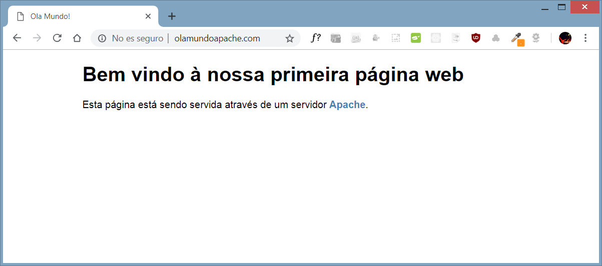

# ¿Qué es Apache?
Apache es el Servidor Web más utilizado, líder con el mayor número de instalaciones a nivel mundial (46%). Es un proyecto de código abierto y uso gratuito, multiplataforma, muy robusto y que destaca por su seguridad y rendimiento. El nombre oficial es **Apache HTTP Server**, y es mantenido y desarrollado por la [Apache Software Foundation](https://www.apache.org/).

## ¿Qué es un servidor Web?
Un servidor web o servidor HTTP es un programa o software informático que procesa una aplicación del lado del servidor, realizando conexiones con el cliente y generando o cediendo una respuesta en cualquier lenguaje o aplicación del lado del cliente.

El trabajo de un servidor web es servir sitios web en Internet. Para lograr ese objetivo, actúa como un intermediario entre el servidor y las máquinas de los clientes. Extrae el contenido del servidor en cada solicitud de usuario y lo envía a la web.   

El mayor desafío de un servidor de este tipo es servir a muchos usuarios diferentes de la web al mismo tiempo, cada uno de los cuales solicita diferentes páginas.  

El código recibido por el cliente es renderizado por un navegador web y para la transmisión de todos estos datos suele utilizarse algún protocolo. Generalmente se usa el protocolo HTTP.

# Opciones al instalar Apache en Ubuntu
Cuando trabajamos en un entorno virtualizado, tenemos dos opciones si queremos instalar un servidor Apache.
1. Incluir todos aquellos comandos necesarios para la instalación en los archivos de provisionamiento de Vagranfile ( por ejemplo en un archivo en BASH que podría llamarse `bootstrap.sh`).
2. Una vez instalada la máquina virtual, acceder a ella mediante `SSH` y ejecutar en su interior los comandos necesarios. Esta opción es la que vamos a cubrir en este tutorial.

# Instalación de Apache en Ubuntu
1. Instalar Apache:
   Introducimos en la línea de comandos o terminal la siguiente instrucción para actualizar el índice de los paquetes locales para garantizar que en él se refleje las cargas más recientes de las nuevas versiones de los paquetes :
   ```shell
   $ apt-get update
   ```
   A continuación instalamos Apache:
   ```shell
   $ sudo ap-get install apache2
   ```

2. Al finalizar el proceso de instalación, Ubuntu inicia Apache por lo que el servidor web debería encontrarse activo y en ejecución. Podemos verificar que el servicio se está ejecutando con el comando:
   ```shell
   $ sudo systemctl status apache2
   ```
   

   (salimos pulsando la tecla <kbd>q</kbd>).

3. Sin embargo, el mejor test para comprobar que el servidor Apache funciona correctamente sería solicitar una página al mismo.   

   A continuación vamos a ver varias maneras de comprobar que el servidor web está funcionado: desde una instalación normal de Ubuntu o a través de una máquina virtual.
   1. **Instalación de Ubuntu**. Para comprobar de primera mano que el servidor apache está funcionando podemos abrir un navegador web y teclear en la barra de direcciones `http://localhost:80` o pinchar en este enlace: [http://localhost:80](http://localhost:80).
   También, desde una terminal podríamos ejecutar el siguiente comando:
      ```shell
      $ curl http://localhost:80
      ```
      `curl` es una herramienta válida para simular las acciones de usuarios en un navegador web. En este caso estamos realizando una petición a la `ip` de nuestro equipo (`localhost` o `127.0.0.1`) y al puerto `80` que es donde emite por defecto Apache.

      El resultado del comando es el archivo html (interpretado como texto plano) que veríamos al acceder a esta dirección a através de un navegador web.
   2. **A través de Vagrant**. Si estamos trabajando en un contexto donde estamos utilizando Vagrant para gestionar una máquina virtual podemos comprobar que Apache está funcionando correctamente como veremos a continuación.

      Como ya sabemos, `Vagrantfile` es el archivo de configuración de Vagrant y nos permite customizar el comportamiento de la máquina virtual. Vagrant file permite _mapear_ los puertos de `guest` y `host` añadiendo a nuestro Vagranfile la siguiente línea:
      ```shell
      config.vm.network "forwarded_port", guest: 80, host: 8000
      ```
      Este parámetro va a permitir comunicar el puerto `80` (puerto en el que está emitiendo Apache) de la máquina virtual con el puerto `8000` del host o anfitrión.

      Una vez modificado Vagranfile deberemos reiniciar la máquina virtual. Como estamos conectados por SSH a la máquina, lo primero que tenemos que hacer es salir de la misma escribiendo:
      ```shell
      $ exit
      ```
      
      
      A partir de este momento volvemos a estar en la terminal de Windows. Ahora reiniciamos la máquina para aplicar los cambios que hemos realizado en `Vagrantfile`. Podemos hacer `vagrant halt` y despúes `vagrant up` o bien directamente
      ```shell
      $ vagrant reload
      ```
      A continuación, podemos abrir un explorador web en la máquina anfitrión e ir a la dirección `http://localhost:8000` para poder ver la página de configuración de Apache, la página por defecto.

      

4. Otra opción interesante sería crear un enlace simbólico para servir una página que nosotros queramos y que esté alojada en un directorio específico.

   Tenemos que eliminar la carpeta que apache crea por defecto que se encuentra alojada en `/var/www/html` (En versiones anteriores de Ubuntu el contenido era servido directamente en la carpeta `www`).

   Nos conectamos de nuevo a la máquina virtual con `vagrant ssh`. Después eliminamos la carpeta `html`:
   ```shell
   $ sudo rm -r /var/www/html
   ```
   A continuación, lo que vamos a hacer es que Apache sirva una página web que vamos a crear y que va a estar alojada en una carpeta que elijamos, en concreto en `/vagrant/pruebaApache/`:

   Creamos la carpeta:

   ```shell
   $ mkdir /vagrant/pruebaApache
   ```
   Creamos un [enlace simbólico](https://en.wikipedia.org/wiki/Symbolic_link):
   ```shell
   $ sudo ln -fs /vagrant/pruebaApache /var/www/html
   ```
   Navegamos hasta el directorio:
   ```shell
   $ cd /vagrant/pruebaApache
   ```
   Ahora crearemos una página web muy sencilla. Todo desde la consola:
   ```shell
   $ echo "<h1>Olá mundo</h1>" > index.html
   ```
   Ahora si navegamos hasta http://localhost:8000/ desde la máquina anfitrión podremos ver el contenido de la página web que hemos creado.

   

   Si queremos, podemos crear una página web con una apariencia un poco más elegante. Editamos el archivo `index.html` localizado en `/vagrant/www/` mediante la orden `nano /vagrant/www/index.html`.

   Nano es el editor de texto por defecto para sistemas Unix. Al ejectutar la orden nano antes de un archivo abrirá este archivo en el editor y podremos empezar a modificarlo. Eliminamos el contenido anterior y pegamos en su interior el siguiente código html:
   ```html
   <!DOCTYPE html>
   <html>
   <head>
     <meta charset="utf-8">
     <title>Ola Mundo!</title>
     <style>
       body { font-family: sans-serif; max-width: 700px; margin: 0 auto; }
       strong { color: steelblue; }
     </style>
   </head>
   <body>
     <h1>Bem vindo à nossa primeira página web</h1>
     <p>Esta página está sendo servida através de um servidor <strong>Apache</strong>.</p>
   </body>
   </html>
   ```

   
   Para guardar los cambios dentro del editor nano pulsamos las teclas <kbd>ctrl</kbd> + <kbd>o</kbd>. Confirmamos los cambios. Para salir pulsamos <kbd>ctrl</kbd> + <kbd>x</kbd>.

   Recargamos la página para ver el contenido actualizado.

   

   Si estamos trabajando con una máquina virtual, podemos apagarla con `vagrant halt`y recargar la página y ver cómo ésta no se carga para comprobar que realmente es el Apache corriendo en la máquina virtual el que está sirviendo la página.
5. Apache divide su funcionalidad y componentes en unidades independientes que pueden ser configuradas independientemente. La unidad básica que describe un sitio individial o el dominio llamado **Virtual Host**.  

   Un Host Virtual o VirtualHost se utiliza para crear varios sitios web en un servidor Apache. Apache incluye un archivo Virtual Host por defecto denominado `000-default.conf` que tiene el siguiente aspecto (hemos eliminado los comentarios para que sea más claro):
   ```shell
   <VirtualHost *:80>
           ServerAdmin webmaster@localhost
           DocumentRoot /var/www/html
           ErrorLog ${APACHE_LOG_DIR}/error.log
           CustomLog ${APACHE_LOG_DIR}/access.log combined
   </VirtualHost>
   ```
   Cualquier peticion que es solicitada al puerto `80`, el puerto por defecto de `HTTP` sirve el contenido que se encuentra dentro de `/var/www/html`.
   Este archivo se encuentra en `/etc/apache2/sites-available/000-default.conf`.

   Ahora vamos a configurar un nuevo Virtual Host para poder acceder a nuestra web través de un nombre de dominio en lugar de la `IP`.
      1. Salimos de la máquina virtual con `exit`.
      2. Modificamos Vagrantfile para crear una conexión de tipo privado:
         ```shell
         config.vm.network "private_network", ip: "192.168.50.4"
         ```
         También, para no interferir en los pasos anteriores creamos un nuevo `forwarded_port` que apunte esta vez al puerto `70` de la máquina virtual y al `7000` del anfitrión.
         ```shell
         config.vm.network "forwarded_port", guest: 70, host: 7000
         ```
      3. Recargamos la máquina virtual para aplicar los cambios en `Vagranfile` con `vagrant reload`.
      4. Entramos en la máquina virtual con `vagrant ssh`.
      5. Creamos un nuevo archivo en el directorio de configuración de apache:
         ```shell
         $ sudo nano /etc/apache2/sites-available/apache-moz.conf
         ```
         Y pegamos el siguiente contenido en su interior:
         ```shell
         <VirtualHost *:70>
               DocumentRoot /var/www/html
               ServerName  www.olamundoapache.com
         </VirtualHost>
         ```
         
      6. Habilitamos nuestro nuevo sitio con la herramienta `a2ensite`:
         ```shell
         $ sudo a2ensite apache-moz.conf
         ```
         Reiniciamos apache:
         ```shell
         $ sudo service apache2 restart
         ```


      7. Si estamos trabajando desde Windows tenemos que editar el archivo hosts que se encuentra alojado en `C:\Windows\System32\drivers\etc`

         Si estamos en Ubuntu el archivo se encuentra en `/etc/`

         Independientemente del Sistema Operativo, añadimos en el archivo `hosts` la siguiente línea:
         ```shell
         192.168.50.4      olamundoapache.com
         ```
         A partir de este momento, sólo tenemos que abrir un navegador e ir a la dirección http://olamundoapache.com/ para ver el conenido de la página web.

         

# Referencias
- Documentación oficial. [Enlace](https://httpd.apache.org/docs/). [En castellano](https://httpd.apache.org/docs/2.4/es/).
- Página de Apache en Wikipedia. [Enlace](https://es.wikipedia.org/wiki/Servidor_HTTP_Apache).
- How To Install the Apache Web Server on Ubuntu 16.04. (Digital Ocean). [Enlace](https://www.digitalocean.com/community/tutorials/how-to-install-the-apache-web-server-on-ubuntu-16-04).