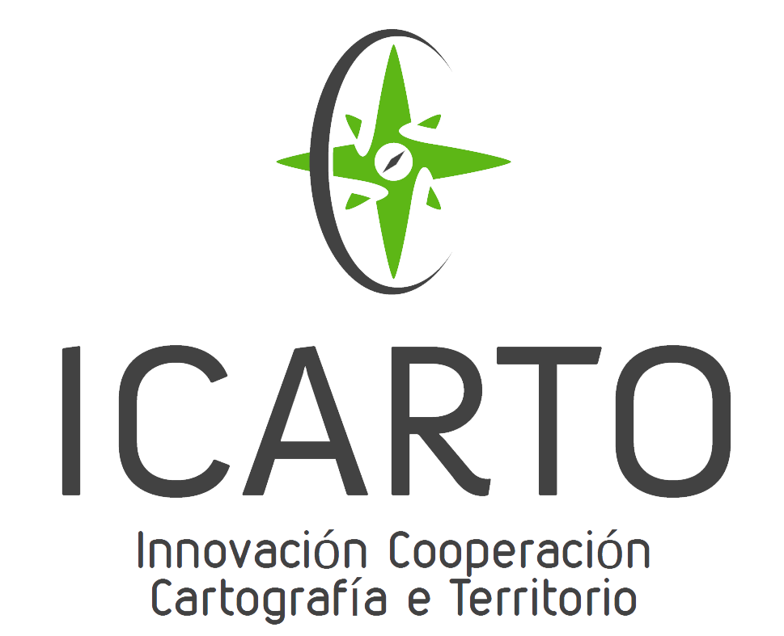

# SIXHIARA. Formación para ITs

## Autores del Taller

## Licencia
 Esta obra está bajo una <a rel="license" href="http://creativecommons.org/licenses/by-sa/4.0/">Licencia Creative Commons Atribución-CompartirIgual 4.0 Internacional</a>.

## Financiado por

## Requerimientos

## Objetivo

## Metodología del curso
El curso es eminentemente práctico por lo que se irán avanzando en los supuestos prácticos que los tutores vayan planteando. Se realizará por parejas por cada equipo.

## Temario
1. Instalar VirtualBox, Vagrant y creación de VMs
   1. Definiciones: Virtualbox, Vagrant, Máquina Virtual
   1. Instalación VirtualBox
   2. Instalación Vagrant
   3. Vagrantfile y creación de VMs
2. Acceso al servidor remoto (o VMs)

