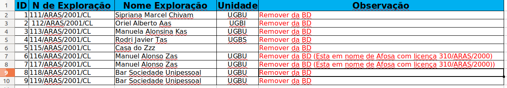
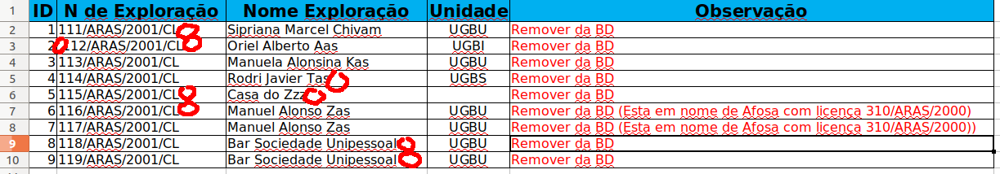
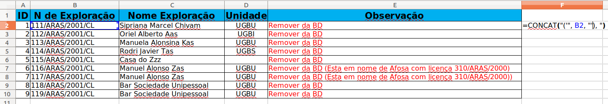
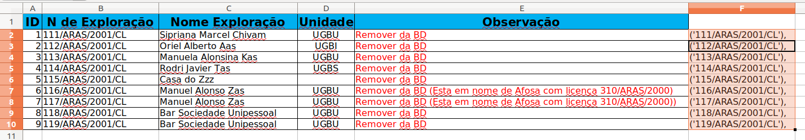
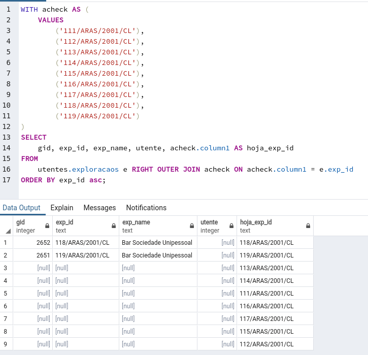
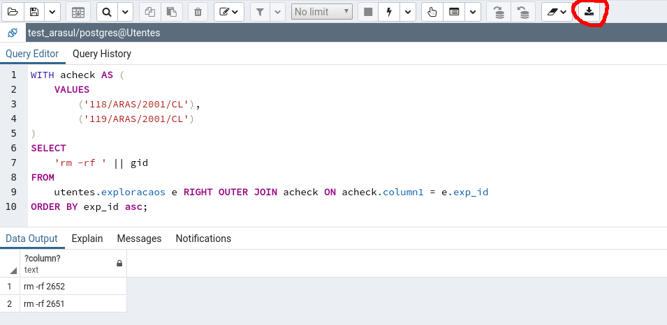

# Eliminar explotaciones en bloque de la base de datos

La aplicación permite eliminar de la base de datos las explotaciones de una en una. Para ello se entra como administrador en la ficha de la explotación y se pulsa en el botón eliminar. Esta forma de trabajar asegura que la eliminación se hace de forma correcta.

En ocasiones resulta de interés eliminar muchas explotaciones a la vez y no resulta cómodo hacerlo de una en una. Esta es una operación que debe realizarse con cuidado puesto que implica varios pasos:

1. Obtener o generar un listado de las explotaciones a eliminar. Generalmente en algún formato tipo hoja de cálculo o csv.
2. [Hacer una copia de seguridad](https://gitlab.com/icarto/ikdb/blob/master/manuales/postgres/dump/postgresql_dump_pgadmin.md)
3. Identificar correctamente el "Nro de exploração", columna `exp_id` de la tabla `utentes.exploracaoes`
4. Identificar correctamente la "Clave Primaria" de la explotación, columna `gid` de la tabla `utentes.exploracoes`
5. No es absolutamente necesario pero resulta útil anotar el "Utente" que posee esa explotación, la columna `utente` de la tabla `utentes.exploracaoes` identifica la clave primaria del "Utente", columna `gid` de la tabla `utentes.utente`.
6. Eliminar las explotaciones de la tabla `utentes.exploracaoes`
7. Eliminar los adjuntos asociados a esas explotaciones del disco duro del servidor
8. Decidir si las "Utentes" que poseen esas explotaciones también deben ser eliminadas. En el caso de que la Utente posea más explotaciones no deberá ser eliminada nunca. En el caso de que ese "Utente" ya no posea más explotaciones debe decidirse si sigue teniendo sentido que esté en el base de datos o es mejor eliminarla.

A continuación describimos los pasos anteriores con mayor detalle.

# Listado de explotaciones a eliminar

Generalmente se hará llegar a la persona que administre la base de datos un listado de explotaciones a eliminar. Idealmente este listado contendrá el "Nro de exploração" o la "Clave Primaria".

Téngase en cuenta que el "Nome da exploração" (columna `exp_name` de la tabla `utentes.exploracaoes`) o el "Nome do utente" (columna `nome` de la tabla `utentes.utentes`) no son datos suficientes para eliminar la explotación, puesto que son datos que pueden estar repetidos y corresponderse con más de una explotación. Si nos proporcionan un listado con sólo estos datos debemos usar otros adicionales como los datos de localización ("Provincia", "Distrito", ...) u otros para averiguar el "Nro de exploração". Y el proceso es bastante más complicado.

Como lo más habitual es tener el "Nro de exploração" nos centraremos en este caso, y veremos una situación habitual. Partamos de que tenemos una hoja de cálculo con este aspecto:



Que se correspondería con un csv como el siguiente (`example_1.xlsx`, `example_1.csv`):

```csv
ID,N de Exploração,Nome Exploração,Unidade,Observação
1,111/ARAS/2001/CL ,Sipriana Marcel Chivam,UGBU,Remover da BD
2, 112/ARAS/2001/CL ,Oriel Alberto Aas,UGBI,Remover da BD
3,113/ARAS/2001/CL,Manuela Alonsina Kas,UGBU,Remover da BD
4,114/ARAS/2001/CL,Rodri Javier Tas ,UGBS,Remover da BD
5,115/ARAS/2001/CL ,Casa do Zzz ,,Remover da BD
6,116/ARAS/2001/CL ,Manuel Alonso Zas,UGBU,Remover da BD (Esta em nome de Afosa com licença 310/ARAS/2000)
7,117/ARAS/2001/CL,Manuel Alonso Zas,UGBU,Remover da BD (Esta em nome de Afosa com licença 310/ARAS/2000))
8,118/ARAS/2001/CL,Bar Sociedade Unipessoal ,UGBU,Remover da BD
9,119/ARAS/2001/CL,Bar Sociedade Unipessoal ,UGBU,Remover da BD
```

Si bien tiene una apariencia normal, hay varios problemas que nos impedirán trabajar correctamente. En esta otra imagen hemos marcado que en el "Nro de exploração" hay espacios al principio o al final del número. Esos espacios pueden hacer que en un proceso (semi) automático, por ejemplo generar una sentencia SQL usando las fórmulas de la hoja de cálculo no se empareje adecuadamente el "Nro de exploração" de la hoja de cálculo con el de la base de datos.



Véase también como en el ID 6 y 7 no está del todo claro como proceder. Cuando este sea el caso, debe clarificarse y o bien corregir el "Nro de exploração" en la hoja de cálculo con el que sea correcto antes de seguir con el proceso, o bien generar una nueva hoja sin esas explotaciones y eliminar las excepciones a mano. En este caso procederemos del segundo modo, movemos a una nueva hoja las dos excepciones para tenerlas localizadas.

Y para eliminar los espacios lo más sencillo es usar la utilidad e "Find & Replace" [como se indica en este texto](https://gitlab.com/icarto/ikdb/blob/master/manuales/hoja_calculo/eliminar_espacios_sobrantes.md).

Tras lanzar el "Find & Replace" podemos obtener un .csv como el siguiente (`example_2.csv`):

```csv
ID,N de Exploração,Nome Exploração,Unidade,Observação
1,111/ARAS/2001/CL,Sipriana Marcel Chivam,UGBU,Remover da BD
2,112/ARAS/2001/CL,Oriel Alberto Aas,UGBI,Remover da BD
3,113/ARAS/2001/CL,Manuela Alonsina Kas,UGBU,Remover da BD
4,114/ARAS/2001/CL,Rodri Javier Tas,UGBS,Remover da BD
5,115/ARAS/2001/CL,Casa do Zzz,,Remover da BD
6,116/ARAS/2001/CL,Manuel Alonso Zas,UGBU,Remover da BD (Esta em nome de Afosa com licença 310/ARAS/2000)
7,117/ARAS/2001/CL,Manuel Alonso Zas,UGBU,Remover da BD (Esta em nome de Afosa com licença 310/ARAS/2000))
8,118/ARAS/2001/CL,Bar Sociedade Unipessoal,UGBU,Remover da BD
9,119/ARAS/2001/CL,Bar Sociedade Unipessoal,UGBU,Remover da BD
```

# Hacer una copia de seguridad

Para evitar perder información si manipulamos la base de datos de forma errónea resulta conveniente realizar una copia antes de empezar el proceso. En [este documento](https://gitlab.com/icarto/ikdb/blob/master/manuales/postgres/dump/postgresql_dump_pgadmin.md) se indica una forma de hacerlo. 


# Identificar correctamente el "Nro de exploração"

El "Nro de exploração" se puede observar en varios puntos de la aplicación como la mayoría de los listados o en la propia ficha. Este valor se corresponde con la columna `exp_id` de la tabla `utentes.exploracaoes`.

Este valor es único para cada explotación, a lo largo del tiempo. Es decir ninguna explotación previa ni futura debería nunca repetir código con una existente. Esté código es por tanto la forma más segura y adecuada de referirnos a una explotación.

Así, cuando tenemos un listado de códigos, que no es obtenido directamente de la aplicación o de la base de datos, sobre el que se puede haber trabajado añadido columnas, modificado los datos, ... siempre debemos asegurarnos de que ese código sigue siendo correcto y las explotaciones del listado coinciden exactamente con las aplicaciones que hay presentes en la base de datos.

La forma de proceder será lanzar una consulta contra la base de datos que empareja el "Nro de exploração" del listado con `utentes.exploracaoes.exp_id`, para revisar que efectivamente las explotaciones están presentes. Hay muchas formas de hacer esto, a continuación presentamos una de ellas:

En una columna libre de la hoja de cálculo, haremos una fórmula para todas las filas que genere el `exp_id` de una forma apta para usarlo en consultas SQL. La fórmula a emplear será `=CONCAT("('", B2, "'), ")` siendo en este caso `B2` la primera celda que tiene un `exp_id`. Extenderemos esta celda a todas las filas dando como resultados textos con esta forma: `('629/ARAS/2018/CL'), `



El resultado será como el siguiente, donde copiaremos la nueva columna y la usaremos para crear los valores de emparejado para las sentencias SQL.



Abriremos una consola de SQL en pgAdmin o la herramienta que empleemos para conectar a la base de datos, y escribiremos una sentencia del tipo:

```sql
WITH acheck AS (
    VALUES
        PEGAR_NUEVA_COLUMNA_GENERADA_ANTES_ELIMINANDO_LA_COMA_FINAL
)
SELECT
    gid, exp_id, exp_name, utente, acheck.column1 AS hoja_exp_id
FROM 
    utentes.exploracaos e RIGHT OUTER JOIN acheck ON acheck.column1 = e.exp_id
ORDER BY exp_id asc;
```

donde substituiremos el texto del ejemplo de `PEGAR_NUEVA_COLUMNA_GENERADA_ANTES_ELIMINANDO_LA_COMA_FINAL` por pegar la nueva columna que generamos en la hoja de cálculo. Quedando un resultado similar al siguiente:

```sql
WITH acheck AS (
    VALUES
        ('111/ARAS/2001/CL'), 
        ('112/ARAS/2001/CL'), 
        ('113/ARAS/2001/CL'), 
        ('114/ARAS/2001/CL'), 
        ('115/ARAS/2001/CL'), 
        ('116/ARAS/2001/CL'), 
        ('117/ARAS/2001/CL'), 
        ('118/ARAS/2001/CL'), 
        ('119/ARAS/2001/CL'), -- esta "," final debe ser eliminada
)
SELECT
    gid, exp_id, exp_name, utente, acheck.column1 AS hoja_exp_id
FROM 
    utentes.exploracaos e RIGHT OUTER JOIN acheck ON acheck.column1 = e.exp_id
ORDER BY exp_id asc;
```

nótese que debemos eliminar la `,` del último valor de `exp_id` para que la sentencia funcione.

```sql
WITH acheck AS (
    VALUES
        ('111/ARAS/2001/CL'), 
        ('112/ARAS/2001/CL'), 
        ('113/ARAS/2001/CL'), 
        ('114/ARAS/2001/CL'), 
        ('115/ARAS/2001/CL'), 
        ('116/ARAS/2001/CL'), 
        ('117/ARAS/2001/CL'), 
        ('118/ARAS/2001/CL'), 
        ('119/ARAS/2001/CL')
)
SELECT
    gid, exp_id, exp_name, utente, acheck.column1 AS hoja_exp_id
FROM 
    utentes.exploracaos e RIGHT OUTER JOIN acheck ON acheck.column1 = e.exp_id
ORDER BY exp_id asc;
```

Con esta sentencia lo que hacemos es preguntar a la base de datos cual es el `gid`, `exp_id`, `exp_name` y el `utente` de las explotaciones que están en la base de datos cuyo código coincide con el de la hoja de cálculo. Y que nos muestre al final de la respuesta aquellos códigos del listado, que no se encuentran en la base de datos.

Así en el siguiente ejemplo vemos como hay 7 explotaciones con códigos `113/ARAS/2001/CL`, `114/ARAS/2001/CL`, ... no se encuentran en la base de datos. Debemos fijarnos además que el total de filas devueltas (en este caso 9) coincide con el total de explotaciones que queremos eliminar.



Debemos pensar que hacer con las explotaciones que no emparejan. Si son pocas podemos anotar sus códigos en otra hoja de cálculo para revisarlas de forma manual. O directamente no seguir con el proceso y explicar a quien genero la hoja de cálculo, que esos códigos no están presentes y que debe revisar y crear de nuevo la hoja.

En este caso como son pocas continuaremos adelante. Eliminamos de la hoja las que no emparejan y volvemos a lanzar la sentencia sql anterior viendo que ya no hay ningún código que no empareje.

Los resultados de esta sentencia podemos descargarlos a un fichero .csv desde pgAdmin o la herramienta que empleemos para consultarlos posteriormente si fuera necesario.

# Identificar correctamente la "Clave Primaria"

Usando la misma sentencia sql de antes ya obtenemos el valor de `gid` de las explotaciones a eliminar. Este valor nos servirá para eliminar los ficheros adjuntos de disco para estas explotaciones.

Un pequeño truco es generar directamente mediante sql los comandos `rm` que debemos ejecutar en un terminal para eliminar esas explotaciones (asumiendo que estamos dentro del directorio de documentación. Eso se haría con una sentencia como la siguiente:

```sql
WITH acheck AS (
    VALUES
        ('118/ARAS/2001/CL'), 
        ('119/ARAS/2001/CL')
)
SELECT
    'rm -rf ' || gid 
FROM 
    utentes.exploracaos e RIGHT OUTER JOIN acheck ON acheck.column1 = e.exp_id
ORDER BY exp_id asc;
```

Recuérdese que los `VALUES` concretos deben cambiarse por los valores concretos de nuestro listado.



Los resultados podemos copiarlos y pegarlos a un fichero de texto o bien descargarlos usando el botón señalado en rojo en la imagen. De este modo sólo tendremos que copiar y pegar luego las sentencias en el terminal.

Una forma alternativa de identificar el gid a través de la aplicación es ir a la ficha de una explotación concreta y fijarnos en la "url" de esa explotación que tendrá esta forma: `http://127.0.0.1:8000/exploracao-show.html?id=1769`. El número tras el parámetro `?id=` será el `gid` o "Clave Primaria" de la explotación.


# Anotar el "Utente" que posee esa explotación

Con la misma sentencia sql del principio también estamos obteniendo la clave primaria del "Utente" que posee esa explotación. Si está en blanco (a `NULL`) significa que la explotación todavía no ha llegado al proceso donde es obligatorio asignar un "Utente".

De nuevo podemos realizar un pequeño truco con sql para generar una sentencia que podemos reutilizar más adelante, que nos permita ver el nombre y el número de explotaciones asociadas a las utentes.

```sql
WITH acheck AS (
    VALUES
        ('118/ARAS/2001/CL'), 
        ('119/ARAS/2001/CL')
)
SELECT
    'SELECT u.gid, u.nome, count(e.*) FROM utentes.utentes u JOIN utentes.exploracaos e ON u.gid = e.utente WHERE u.gid = ANY(''' || array_agg(utente)::text || ''') GROUP BY u.gid, u.nome;'
FROM 
    utentes.exploracaos e RIGHT OUTER JOIN acheck ON acheck.column1 = e.exp_id WHERE e.utente IS NOT NULL;
;
```

que generará un resultado similar a este:

```sql
SELECT u.gid, u.nome, count(e.*) FROM utentes.utentes u JOIN utentes.exploracaos e ON u.gid = e.utente WHERE u.gid =  ANY('{2152,2134}') GROUP BY u.gid, u.nome;
```

Si copiamos esta nueva sentencia y la ejecutamos nos dará el nombre de la utente y el número de explotaciones que tiene asociada. Si no quedan explotaciones asociadas a esa utente en algunos casos tendrá sentido eliminarlas de la base de datos.

Esta sentencia la podemos volver a ejecutar tras eliminar las explotaciones para ver que "Utentes" se quedan sin explotaciones tras el proceso.


# Eliminar las explotaciones

Habiendo obtenido los `exp_id` o los `gid` borrar las explotaciones es una tarea sencilla. Todo el modelo de datos de la aplicación se encuentra enlazado por claves primarias de modo que borrando de la tabla `utentes.exploracaoes` se eliminarán los datos del resto de tablas: facturación, actividad, ...

De nuevo podemos recurrir a nuestra sentencia inicial para eliminar las explotaciones. Eso sí, esta vez comenzaremos tecleando una sentencia `BEGIN;`. Esto indica a la base de datos que todas las sentencias que introduzcamos a continuación se ejecutarán como una sóla transacción. Algo que podríamos describir como que no serán efectivas hasta que "escribamos" a transacción mediante una sentencia `COMMIT;`. Si en algún momento antes de lanzar el `COMMIT;` se produce un error o nos damos cuenta de que algo ha ido mal, podemos revertir el proceso (hasta el punto donde hubiéramos tecleado el `BEGIN`) introduciendo la sentencia `ROLLBACK`

```sql

BEGIN;

SELECT count(*) FROM utentes.exploracaos; -- obtenemos el número de explotaciones antes del borrado

WITH acheck AS (
    VALUES
        ('118/ARAS/2001/CL'), 
        ('119/ARAS/2001/CL')
)
DELETE FROM utentes.exploracaos e WHERE e.exp_id IN (SELECT column1 FROM acheck);

SELECT count(*) FROM utentes.exploracaos; -- obtenemos el número de explotaciones después del borrado

-- Si es correcto hacemos COMMIT. Si no ROLLBACK.
COMMIT;
```

# Eliminar los adjuntos asociados

Con la lista de `gid` de las explotaciones eliminadas que obtuvimos en el paso anterior, o bien directamente los comandos `rm` podemos abrir un terminal al servidor y borrar los directorios de los adjuntos correspondientes a las explotaciones eliminadas.

Por supuesto no está demás realizar una copia de seguridad del directorio completo de ficheros por si hubiera algún problema.


# Decidir si las "Utentes" que poseen esas explotaciones también deben ser eliminadas

Como se explicó en un paso anterior también podemos ahora decidir que hacer si quedan Utentes que ya no posean explotaciones.

En general si la Utente tiene sus datos rellenos y son correctos no deberíamos eliminarla. 
